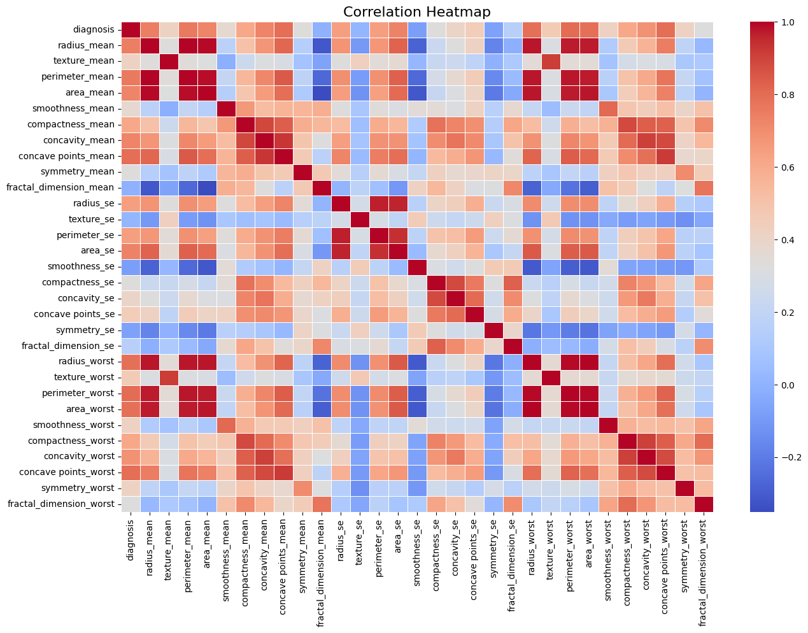
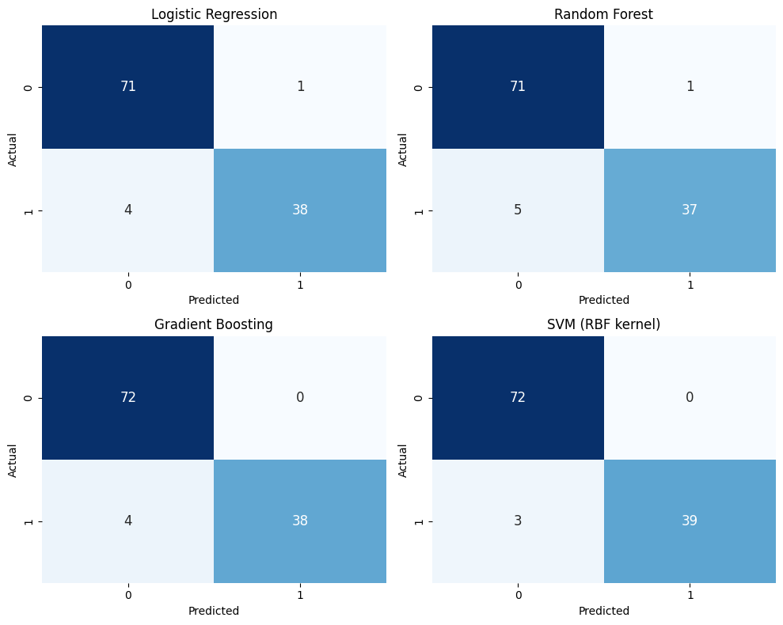
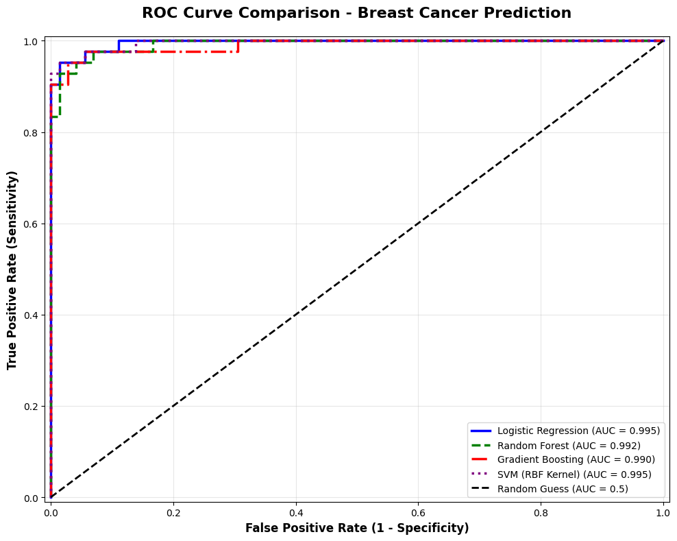
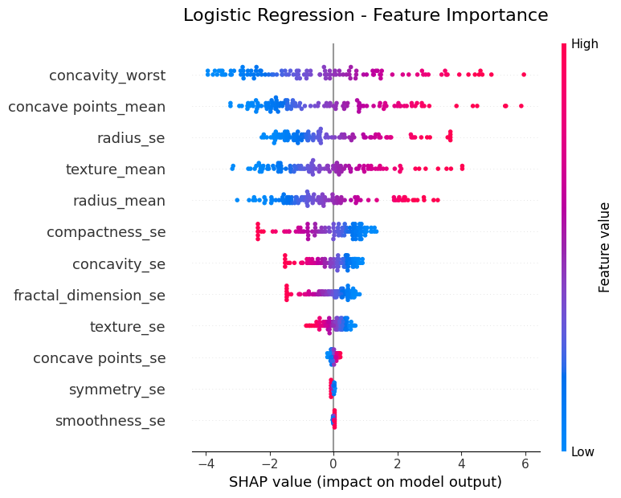

# 🩺 Breast Cancer Prediction using Machine Learning

## 📌 Project Overview
Breast cancer is one of the leading causes of mortality among women worldwide, and early detection plays a crucial role in improving survival rates.

This project presents an end-to-end **machine learning–based diagnostic system** to classify breast tumours as **benign** or **malignant** using clinical features from the **Wisconsin Breast Cancer Diagnostic (WBCD) dataset**.

The project was developed as part of a **Python and Machine Learning Internship** and focuses on building an accurate, interpretable, and reliable prediction pipeline suitable for healthcare decision-support systems.

---

## 👩‍💻 Team Members
- **Pratigya Sachdeva** (15501012024)
- **Neha Binu** (13201012024)

---

## 🎯 Objectives
- Understand and analyse a real-world medical dataset
- Apply complete data preprocessing and exploratory data analysis (EDA)
- Train and evaluate multiple machine learning classification models
- Perform feature selection and dimensionality reduction
- Improve model performance through optimization techniques
- Ensure transparency and interpretability using Explainable AI (XAI)

---

## 📊 Dataset
- **Dataset Name:** Wisconsin Breast Cancer Diagnostic (WBCD) Dataset
- **Source:** UCI Machine Learning Repository
- **Features:** 30 numerical diagnostic features
- **Target Classes:**
  - `0` → Benign
  - `1` → Malignant

The dataset contains measurements computed from digitized images of breast mass cell nuclei.

⚠️ **Note:**  
The dataset file (`data.csv`) is required to run the notebook.  
Ensure it is placed in the same directory as the notebook or update the file path accordingly.

---

## ⚙️ Tools & Technologies Used

### Programming & Environment
- Python 3.x
- Google Colab

### Libraries
- NumPy
- Pandas
- Scikit-learn
- Matplotlib
- Seaborn
- SHAP (Explainable AI)

---

## 🧠 Methodology

### 1. Data Preprocessing
- Removal of non-informative columns
- Handling missing values and duplicates
- Outlier detection using IQR method
- Skewness correction using log transformations
- Feature scaling using StandardScaler
- Multicollinearity reduction using correlation analysis and VIF

---

### 2. Exploratory Data Analysis (EDA)

#### Diagnosis Distribution
The dataset shows a slightly imbalanced distribution between benign and malignant cases.

#### Feature Correlation Analysis
A correlation heatmap was used to identify highly correlated features and reduce redundancy.

---

### 3. Model Development
The following supervised learning models were implemented and evaluated:
- Logistic Regression
- Random Forest
- Gradient Boosting
- Support Vector Machine (SVM – RBF kernel)

Each model was trained using an 80/20 stratified train–test split and evaluated using standard performance metrics.

---

### 4. Feature Selection & Dimensionality Reduction
- Principal Component Analysis (PCA)
- Recursive Feature Elimination (RFE)
- Chi-Square Test

PCA reduced the feature space from 30 to 9 components while preserving approximately **95% of the total variance**.

---

### 5. Model Evaluation

#### Confusion Matrix
Confusion matrices were used to evaluate classification performance for each model.

#### ROC Curve Comparison
ROC curves demonstrate the strong discriminatory power of all models, with SVM achieving the highest AUC.

---

### 6. Explainable AI (XAI)
To ensure interpretability and transparency, **SHAP (SHapley Additive Explanations)** was applied.

Key influential features identified include:
- `concavity_worst`
- `concave_points_mean`
- `radius_mean`
- `texture_mean`

These features significantly contributed to distinguishing malignant tumours.

---

## 📈 Results & Performance

| Model | Accuracy |
|------|----------|
| Logistic Regression | ~95.6% |
| Random Forest | ~94.7% |
| Gradient Boosting | ~96.5% |
| SVM (RBF Kernel) | ~97.4% |
| **PCA + SVM (Best Model)** | **≈ 99.12%** |

✅ **Best Performing Model:** PCA + SVM  
✅ **Final Accuracy:** ≈ **99.12%**

---

## ▶️ How to Run the Project

### 1. Clone the repository
    git clone https://github.com/your-username/Breast-Cancer-Prediction-ML
  
### 2.	Open the notebook:
	Breast_Cancer_Prediction.ipynb

### 3. Ensure dataset availability
- Place data.csv in the project directory
- Or update the dataset path inside the notebook

---

## 📌 Conclusion
This project demonstrates how structured data preprocessing, robust machine learning models, and explainable AI techniques can be combined to build a highly accurate and interpretable breast cancer prediction system.

The PCA-enhanced SVM model achieved superior performance, highlighting the importance of dimensionality reduction in medical datasets.

This work contributes toward applying machine learning in healthcare for early diagnosis and clinical decision support.

---

## 🔗 References
- UCI Machine Learning Repository – Breast Cancer Dataset
- Lundberg & Lee (2017) – SHAP Explainability
- World Health Organization – Breast Cancer Factsheet
